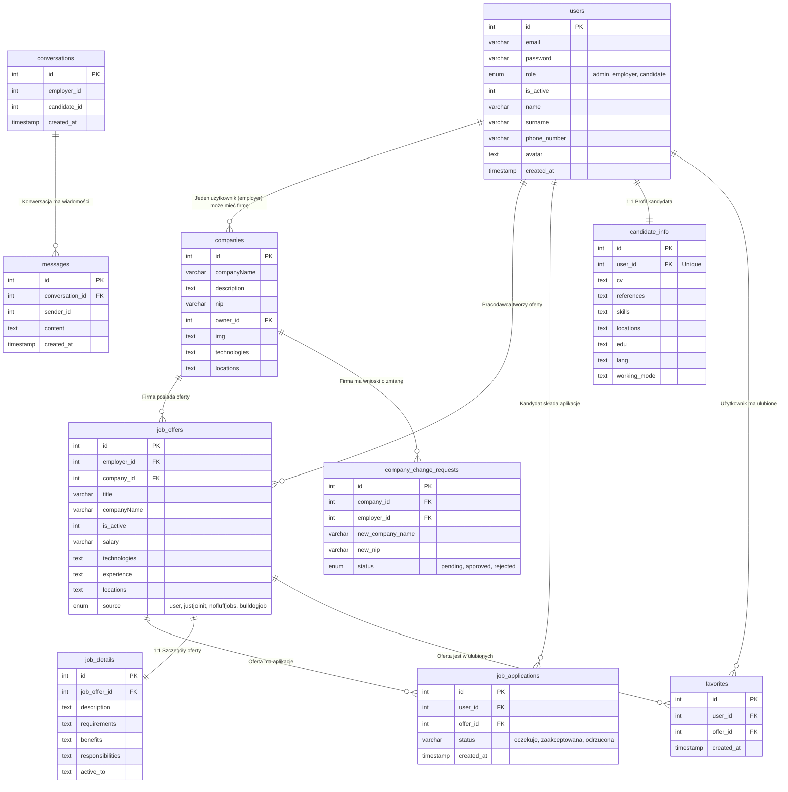
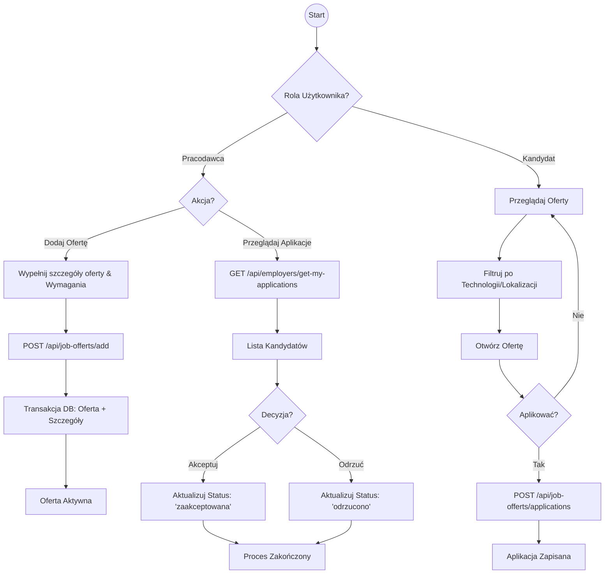
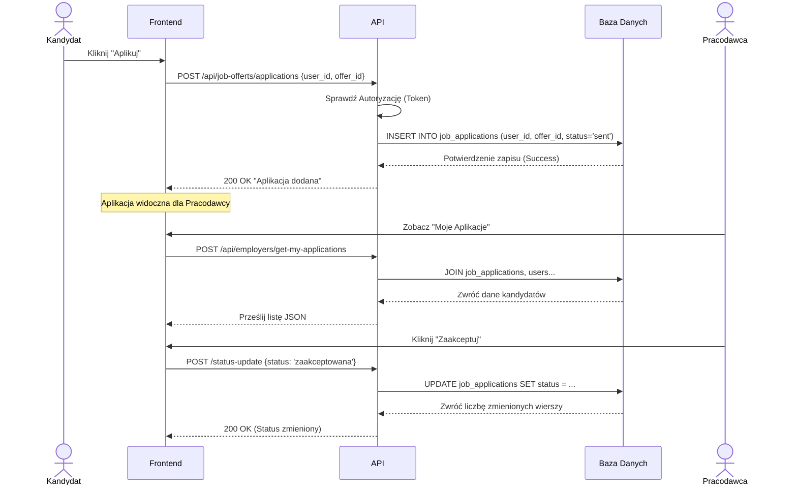
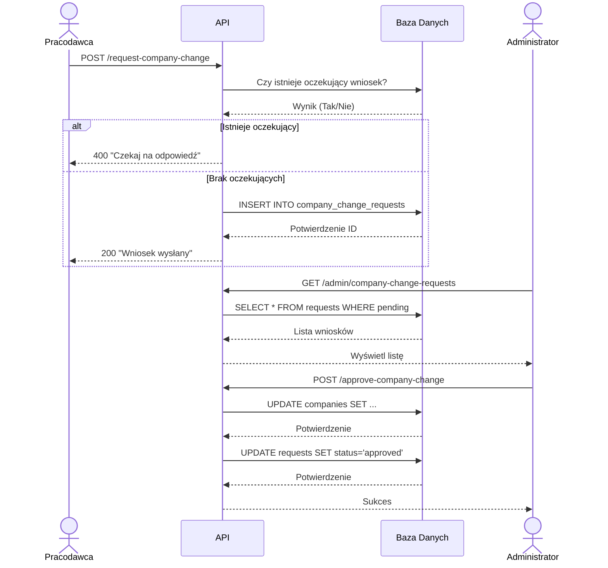
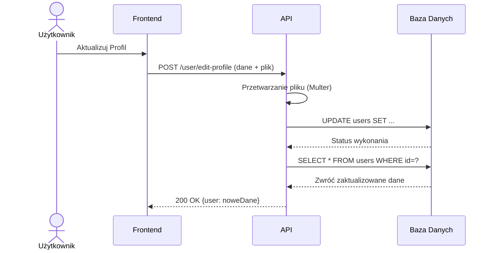
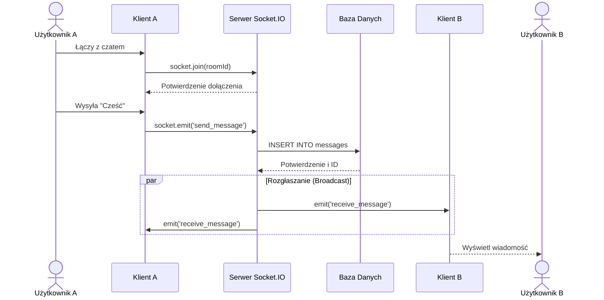

# Diagramy Projektowe

## Diagram ERD Bazy Danych

Diagram przedstawia strukturę bazy danych na podstawie pliku `init.sql`.



## Schemat Architektury Systemu

Poniższy diagram przedstawia architekturę całego rozwiązania, z podziałem na kontenery Docker, moduły wewnętrzne oraz dwukierunkową komunikację.

```mermaid
flowchart TB
    subgraph Host[Maszyna Hosta]
        direction TB
        
        subgraph Docker[Środowisko Docker]
            direction TB
            
            %% ---------- FRONTEND CONTAINER ----------
            subgraph FE_Container[Kontener: Frontend (React)]
                direction TB
                UI_Core[Frontend App]
                
                subgraph FE_Modules[Moduły Frontendowe]
                    FE_Auth[Moduł Autoryzacji\n(LoginPage, RegisterPage)]
                    FE_Jobs[Moduł Ofert Pracy\n(JobOffersPage, AddOffert)]
                    FE_Chat[Moduł Czatu\n(Chat Component)]
                    FE_Admin[Panel Administratora\n(AdminPanel)]
                    FE_Emp[Panel Pracodawcy\n(Employers)]
                end
                
                UI_Core --- FE_Auth
                UI_Core --- FE_Jobs
                UI_Core --- FE_Chat
                UI_Core --- FE_Admin
                UI_Core --- FE_Emp
            end

            %% ---------- BACKEND CONTAINER ----------
            subgraph BE_Container[Kontener: Backend (Node.js/Express)]
                direction TB
                API_Gateway[API Server\n(server.js)]
                
                subgraph BE_Modules[Moduły Backendowe]
                    BE_Auth[Kontroler Autoryzacji\n(authRoutes)]
                    BE_Jobs[Serwis Ofert\n(jobOffertsRoutes)]
                    BE_Chat[Obsługa Socket.IO\n(chatRoutes)]
                    BE_Admin[Logika Admina\n(adminRoutes)]
                    BE_Stats[Moduł Statystyk\n(statsRoutes)]
                end
                
                API_Gateway --- BE_Auth
                API_Gateway --- BE_Jobs
                API_Gateway --- BE_Chat
                API_Gateway --- BE_Admin
                API_Gateway --- BE_Stats
            end

            %% ---------- DATABASE CONTAINER ----------
            subgraph DB_Container[Kontener: Baza Danych (MySQL)]
                direction TB
                SQL_DB[(Baza Danych\nMySQL 8.0)]
            end
        end
    end

    %% ---------- EXTERNAL USER ----------
    User((Użytkownik\nPrzeglądarka WWW))

    %% ---------- CONNECTIONS (2-WAY) ----------
    
    %% User <-> Frontend
    User <==>|HTTP / Interakcja| FE_Container
    
    %% Frontend <-> Backend
    FE_Auth <==>|POST /auth/login\n<-- JSON (Token)| BE_Auth
    FE_Jobs <==>|GET/POST /api/job-offerts\n<-- JSON (Oferty)| BE_Jobs
    FE_Chat <==>|WebSocket (Eventy)\n<-- Nowe Wiadomości| BE_Chat
    FE_Admin <==>|API Admina\n<-- Dane Systemowe| BE_Admin
    
    %% Backend <-> Database
    BE_Auth <==>|SELECT/INSERT User\n<-- Wynik Zapytania| SQL_DB
    BE_Jobs <==>|SELECT/INSERT Offer\n<-- Wynik Zapytania| SQL_DB
    BE_Chat <==>|INSERT Message\n<-- ID Wiadomości| SQL_DB
    BE_Admin <==>|CRUD Operations\n<-- Data Rows| SQL_DB
    BE_Stats <==>|Agregacja Danych\n<-- Wyniki Liczbowe| SQL_DB

    %% Styling
    classDef container fill:#e1f5fe,stroke:#01579b,stroke-width:2px;
    classDef module fill:#ffffff,stroke:#333,stroke-width:1px;
    classDef db fill:#fff3e0,stroke:#e65100,stroke-width:2px;
    
    class FE_Container,BE_Container,DB_Container container;
    class FE_Auth,FE_Jobs,FE_Chat,FE_Admin,FE_Emp,BE_Auth,BE_Jobs,BE_Chat,BE_Admin,BE_Stats module;
    class SQL_DB db;
```

---

## Diagramy Aktywności

### 1. Uwierzytelnianie Użytkownika (Rejestracja i Logowanie)
```mermaid
flowchart TD
    start((Start)) --> action_choice{Logowanie czy Rejestracja?}
    
    %% Ścieżka Logowania
    action_choice -->|Logowanie| login_form[Wprowadź dane logowania]
    login_form --> validate_login{Pola wypełnione?}
    validate_login -->|Nie| show_login_err[Pokaż błąd] --> login_form
    validate_login -->|Tak| req_login[POST /auth/login]
    req_login --> check_user{Użytkownik istnieje?}
    check_user -->|Nie| login_fail[Błąd: Nie znaleziono użytkownika] --> login_form
    check_user -->|Tak| check_pass{Hasło poprawne?}
    check_pass -->|Nie| login_fail 
    check_pass -->|Tak| check_active{Konto aktywne?}
    check_active -->|Nie| account_inactive[Błąd: Konto zawieszone/nieaktywne] --> login_form
    check_active -->|Tak| gen_token[Generuj token JWT]
    gen_token --> access_granted[Logowanie pomyślne] --> end_login((Koniec))

    %% Ścieżka Rejestracji
    action_choice -->|Rejestracja| reg_form[Wypełnij formularz rejestracji]
    reg_form --> role_choice{Rola?}
    
    role_choice -->|Kandydat| reg_cand[Podaj dane kandydata]
    role_choice -->|Pracodawca| reg_emp[Podaj dane firmy (NIP, Nazwa)]
    
    reg_cand --> req_reg[POST /auth/registre]
    reg_emp --> req_reg
    
    req_reg --> check_dup{Email zajęty?}
    check_dup -->|Tak| show_reg_err[Błąd: Użytkownik istnieje] --> reg_form
    check_dup -->|Nie| create_user[Dodaj użytkownika do DB]
    
    create_user --> role_check_db{Rola?}
    role_check_db -->|Kandydat| set_active[Ustaw Active = 1] 
    role_check_db -->|Pracodawca| insert_company[Dodaj dane firmy] --> set_inactive[Ustaw Active = 0]
    
    set_active --> reg_success[Sukces: Zarejestrowano] --> end_reg((Koniec))
    set_inactive --> wait_admin[Sukces: Oczekiwanie na aktywację Administratora] --> end_reg
```

### 2. Cykl Życia Oferty Pracy i Aplikacji


### 3. Panel Administratora
```mermaid
flowchart TD
    start((Start)) --> admin_dash[Panel Administratora]
    admin_dash --> choice{Zarządzaj Sekcją}
    
    choice -->|Użytkownicy| list_users[Lista Użytkowników /admin/get-users]
    list_users --> user_action{Akcja}
    user_action -->|Aktywuj/Dezaktywuj| update_user[PUT /users/:id]
    user_action -->|Usuń| del_user[DELETE /delete-user]
    
    choice -->|Firmy| list_comps[Lista Firm]
    list_comps --> comp_reqs[Sprawdź wnioski o zmianę danych]
    comp_reqs --> req_decision{Zatwierdzić?}
    req_decision -->|Tak| update_comp[Aktualizuj dane firmy]
    req_decision -->|Nie| reject_req[Odrzuć wniosek]
    
    choice -->|Oferty| list_offers[Lista Ofert]
    list_offers --> del_offer[Usuń nieodpowiednią ofertę]
    
    choice -->|Scraper| run_scrap[Uruchom Scraper]
    run_scrap --> bg_job[Zadanie w tle (Backend)]
```

---

## Diagramy Sekwencji

### 1. Proces Aplikowania na Ofertę (Komunikacja Dwustronna)


### 2. Wniosek o Zmianę Danych Firmy


### 3. Edycja Profilu


### 4. Czat w Czasie Rzeczywistym

